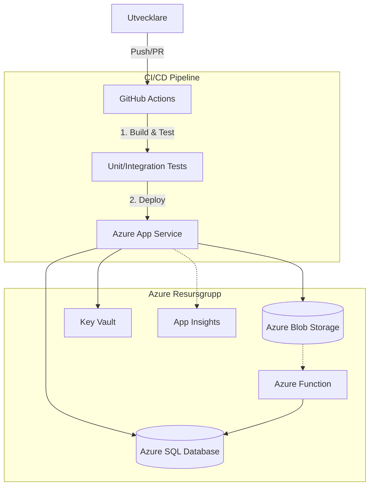

# Architecture

## System-översikt (Mermaid flowchart)

```mermaid
graph TD
    %% Användare och Utveckling
    Dev[Utvecklare] -->|Push/PR| GHA[GitHub Actions]
    
    subgraph CI_CD_Flöde [CI/CD Pipeline]
        GHA -->|1. Build & Test| Test[Unit/Integration Tests]
        Test -->|2. Deploy| WebApp
    end

    %% Azure Miljön
    subgraph Azure_Cloud [Azure Resursgrupp]
        WebApp[Azure App Service]
        SQL[(Azure SQL Database)]
        Blob[(Azure Blob Storage)]
        AzFunc[Azure Function]
        
        WebApp --> SQL
        WebApp --> Blob
        Blob -.-> AzFunc
        AzFunc --> SQL
        
        %% Säkerhet och Monitorering
        WebApp --> KeyVault[Key Vault]
        WebApp -.-> AppInsights[App Insights]
    end

    classDef plain fill:#fff,stroke:#333,stroke-width:1px;
    class User,ServiceLayer plain;
    
```

